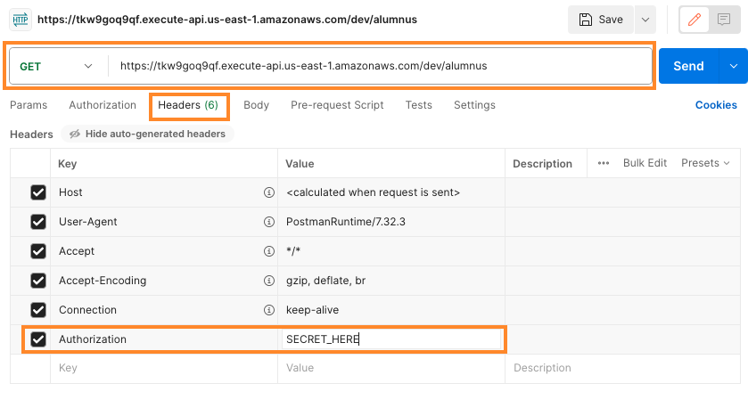

# Introduction to API Gateway Lambda Proxy Functions

This repository will deploy a pair of API Gateway endpoints with different deployment options.  The goal is to illustrate the art of the possible and highlight some considerations.

This infrastructure was built using the [AWS Cloud Development Kit (CDK)](https://docs.aws.amazon.com/cdk/v2/guide/home.html).  Instructions for deployment are included.

---

## Overview

### API Gateway Components

There are a number of [API Gateway API integration types](https://docs.aws.amazon.com/apigateway/latest/developerguide/api-gateway-api-integration-types.html).  In this example, the integration will be a Lambda proxy integration.  With this type of integration you do not set the integration request or the integration response. API Gateway passes the incoming request from the client as the input to the backend Lambda function, and passes the response from the function back to the client.

*The Lambda proxy integration supports a streamlined integration setup with a Lambda function. The setup is simple and can evolve with the backend without having to tear down the existing setup. For these reasons, it is highly recommended for integration with a Lambda function.*

The integrated Lambda function takes the [input of this format](https://docs.aws.amazon.com/apigateway/latest/developerguide/set-up-lambda-proxy-integrations.html#api-gateway-simple-proxy-for-lambda-input-format) and parses the input from all available sources, including request headers, URL path variables, query string parameters, and applicable body. The function returns the result following this [output format](https://docs.aws.amazon.com/apigateway/latest/developerguide/set-up-lambda-proxy-integrations.html#api-gateway-simple-proxy-for-lambda-output-format).

There are two examples in this environment:

1. The API resources, methods (`GET`), and the configuration for a path parameter are explicitly defined in API gateway.

2. An API resource is defined with with an `ANY` method and a greedy path variable.

In both cases, the API routes requests to back-end Lambda functions for fulfillment.  Each example has its own Lambda function.

### Lambda Functions/Logic

The Lambda functions in this example highlight an API for programmatically looking up alumni data.

There is a JSON data source (maintained in the function itself) that stands-in for a true data source (e.g. persistent data store like a data lake or database) that would typically be queried for this information.

The client ([postman.com](https://www.postman.com/) in this example) will be able to submit a GET request to the API Gateway endpoint/resource and query by the alum's user name.  Requests can be made using query strings as parameters, or by using a path based parameter (with support for optional query strings).

Because the APIs are Internet facing, an [API Gateway Lambda authorizer](https://docs.aws.amazon.com/apigateway/latest/developerguide/apigateway-use-lambda-authorizer.html) will allow only properly authorized clients to invoke the API.  There is a secret stored in [AWS Secrets Manager](https://docs.aws.amazon.com/secretsmanager/latest/userguide/intro.html) which must be included in an `Authorization` header when the API is invoked.  If the client secret matches the stored secret, invocation is allowed, else denied.

---

## Deployment

* In the AWS Console, open [CloudShell](https://docs.aws.amazon.com/cloudshell/latest/userguide/welcome.html) and initialize your account/region for the CDK

```shell
cdk bootstrap aws://ACCOUNT_NUMBER/REGION
```
* Download and extract the provided archive in your CloudShell environment
* Create a Python virtual environment, activate it, and install the requirements

```shell
python3 -m venv .venv
source .venv/bin/activate
pip3 install -r requirements.txt
```
* Synthesize the project and deploy

```shell
cdk synth
cdk deploy
```

Note: you may need to update to the latest version of the CDK before you can *synth* or *deploy*: `sudo npm install -g aws-cdk@latest`

See [Getting started with the AWS CDK](https://docs.aws.amazon.com/cdk/v2/guide/getting_started.html) to learn more

---

## Setup

### AWS
#### Secrets Manager 
In order to invoke the API, you'll need to supply an *Authorization* token.  You can obtain it from the AWS Secrets Manager console

* Log into the AWS Console
* Ensure you're in the region where you deployed the stack
* Navigate to the AWS Secrets Manager console
* Find and click on the secret
* In the *Secret value* section, click the *Retrieve secret value* button
* Copy the secret to a location you can get back to easily

#### API Gateway

Note: You can find/copy these values from the Outputs tab of the stack in the CloudFormation console (fewer clicks)

* Navigate to the API Gateway console
* Select the one of the APIs
* Click *Stages* in the left menu
* Select the *dev* stage
* Copy the *Invoke URL* to a location you can get back to easily, be sure to note which API it invokes (GET or ANY)

Repeat the steps above for the other API

### Postman

#### GET API

* Navigate to [https://www.postman.com/](https://www.postman.com/)
* Open *My Workspace*, and click the + symbol to open a new tab
* In the URL bar paste the URL for the `GET` API and append `/alumnus`
  * Example:  `https://tkw9goq9qf.execute-api.us-east-1.amazonaws.com/dev/alumnus`
* Select *Headers* and add a `Authorization` key with the value of the secret you copied earlier



* Click the *Save* button
  * Enter `GET API` as the *Request name*
  * Choose *New Collection*
  * Enter `API Test` and click the *Create* button
  * Click the *Save* button

#### ANY API

<!-- * Navigate to [https://www.postman.com/](https://www.postman.com/) -->
* While in *My Workspace*, click the + symbol to open a new tab
* In the URL bar paste the URL for the `ANY` API and append `/alumnus`
  * Example:  `https://tkw9goq9qf.execute-api.us-east-1.amazonaws.com/dev/alumnus`
* Select *Headers* and add a `Authorization` key with the value of the secret you copied earlier

* Click the *Save* button
  * Enter `ANY API` as the *Request name*
  * Be sure that `API Test` is the active workspace
  * Click the *Save* button

Now that both endpoints are configured in Postman, you can experiment with invocation.

## Experimentation

With each of these experiments, explore the data returned by API Gateway.  Postman makes it easy to explore the body, headers, HTTP status codes, invocation time, etc.  The experiments will work the same for either API.

| Experiment | Result |
|---|---|
| Click the *Send* button | This will result in a "Missing required request parameters: [uname]" Message |
| In *Params*, add a `uname` key and set the value to `bobsmith`.  Note how the URL changes.  Click the  *Send* button | This is an example of using a query parameter and will return the full record for Bob Smith |
| Remove the checkbox next to the `uname` parameter.  Append `/bobsmith` to the URL (ex: https://tkw9goq9qf.execute-api.us-east-1.amazonaws.com/dev/alumnus/bobsmith).  Click the *Send* button | This uses a path based parameter to provide the `uname` to the API.  The result is the same as the previous example, you're given the full record for Bob Smith |
| Under the `uname` key, add a `field` key with a value of `first_name`.  Under that, add another `field` key with a value of `last_name`.  Click the *Send* button | This employs an optional *field* query parameter to filter out the data you don't need and return only the data you do |
| Experiment with changing the API method from `GET` to `POST` | The response will differ depending on which API (`GET` or `ANY`) you're invoking |

Play around with your own combination of parameters and invocations.

## Notes

While each of the APIs behave similarly from the perspective of the client, they are architected differently and the back-end functions differ because of the architecture.

Both of the integrations are known as *Lambda proxy integrations*, API Gateway will proxy the requests directly to a back-end Lambda function for processing.  The next two sections will highlight some of the differences between the two implementations.

### GET API - Defining the API Model

API Gateway allows you explicitly define resources and methods that comprise your API.  You can think of them as a tree that builds off of a root, for example, if you're building a pet store, you might have a `/pets` resource that represents a collection of available pets.  The `/pets/{petId}` could expose an individual pet of a given identifier (*petId*). The item in curly braces allows you to pass the ID to the API as a path parameter, which, becomes a component of the overall request parameters.  Under each of these entities you can define HTTP methods to interact with your API.

The GET API in this repository is a simple example of a defined API in API Gateway.  It is explicit about the resources (`/alumnus` and `/alumnus/{uname}`) and the supported method (`GET`).  You can build on this and make it more complex depending on your use case.

This mechanism requires more configuration in API Gateway.  As you develop new functionality you'll need to revisit your API Gateway configuration as well as writing the functional code to support new features.  There can be scenarios where your path schema needs a change, and implementing those changes can break your defined API.

<!-- * non-GET methods will return `403 Forbidden` as GET is defined in the API
* Path parameters beyond those explicitly configured return `403 Forbidden` -->

### ANY API - Loosely Defined API Model

API Gateway allows you more generally define your API and handle the logic of doing so in your code.

The service supports an HTTP method of `ANY`. This `ANY` method represents any HTTP method that is to be supplied at run time. It allows you to use a single API method setup for all of the supported HTTP methods of `DELETE`, `GET`, `HEAD`, `OPTIONS`, `PATCH`, `POST`, and `PUT`.

API Gateway also allows you to define a proxy resource as a placeholder for a resource to be specified when the request is submitted. A proxy resource is expressed by a special path parameter of `{proxy+}`, often referred to as a greedy path parameter. The `+` sign indicates whichever child resources are appended to it. The `/alumnus/{proxy+}` placeholder stands for any resource matching the path pattern of `/alumnus/*`. The greedy path parameter name, `proxy`, can be replaced by another string in the same way you treat a regular path parameter name.  You saw this in practice earlier when you used `/alumnus/bobsmith` to invoke the API.

As your API matures, defining your API using `ANY` and placeholder values can simplify your development and deployment effort.